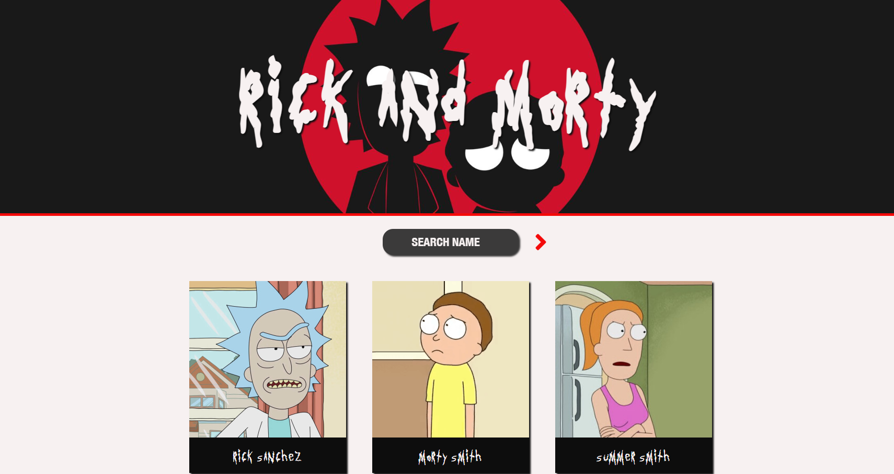
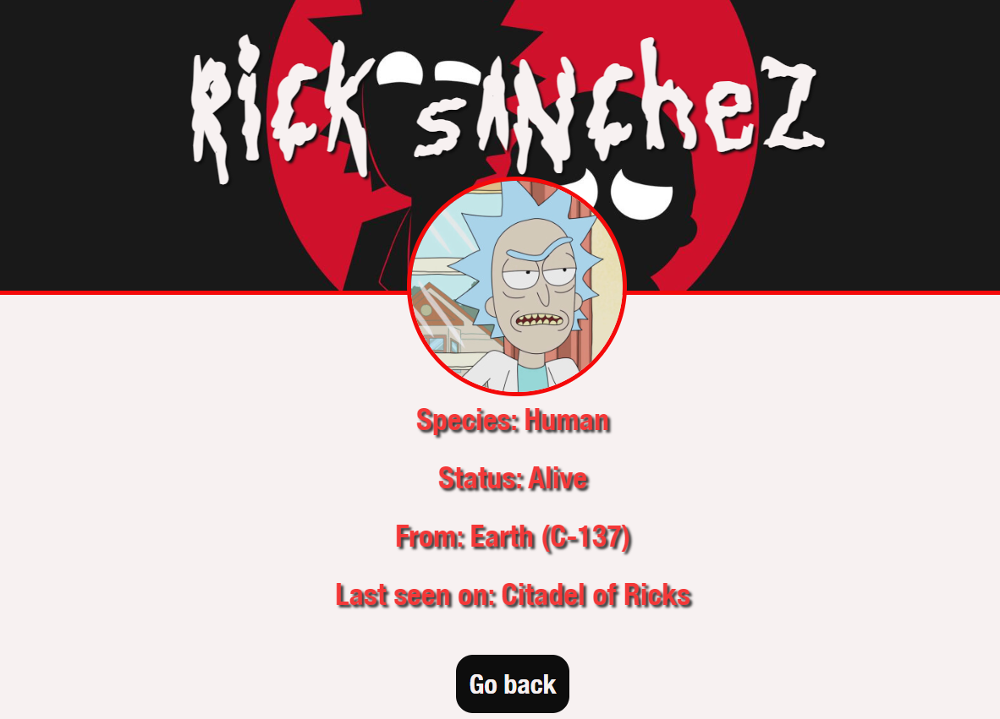

# Rick-Morty Single Page Application
 
Welcome to Rick&Morty SPA, a dynamic, dark themed web application designed as a gateway to the captivating world of "Rick and Morty." Dive into the universe of this iconic series, where fans can embark on an interactive journey to discover and delve into the intricacies of characters and episodes. Powered by a public Rick and Morty API, this project seamlessly integrates technology and fandom, enabling users to effortlessly access and explore character details, making it a unique fusion of technology and fan engagement.

## **Features:**
-**Character List:** View a list of characters with their basic information.

-**Character Details:** Access detailed information about each character, including species, status, origin, and last seen location.

-**Search Functionality:** Instantly find your favorite characters by name.

-**Responsive Design:** Designed to work on desktops, tablets, and mobile devices for easy access anytime, anywhere.

## **Technologies:**
-**Vanilla JavaScript:** For creating interactive features without the need for additional frameworks.

-**CSS**

-**HTML**

-**Rick and Morty API:** Leveraged for fetching up-to-date data on characters and episodes.

## **Live Demo:**

-**Check it for yourself here:** 

## **ScreenShots:**

